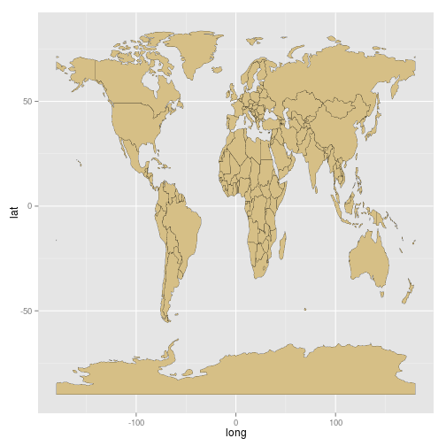
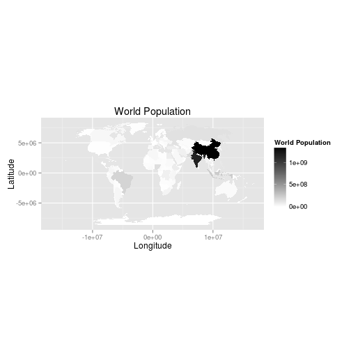
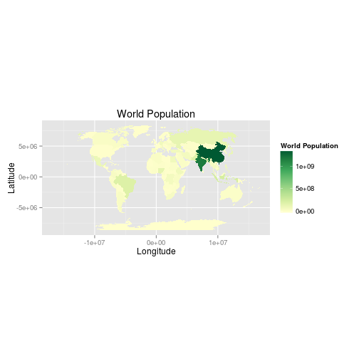
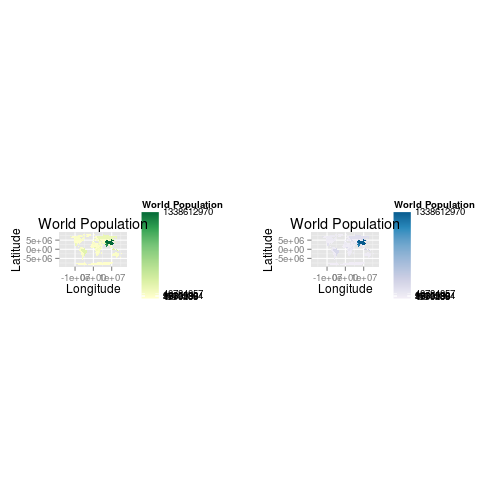
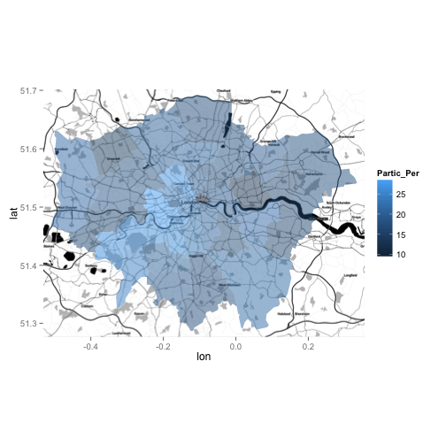

Fundamentals of Spatial Data Visualisation
==========================================

Good maps depend on sound analysis and data preparation and can have an enormous impact on the understanding and communication of results. It has never been easier to produce a map. The underlying data required are available in unprecedented volumes and the technological capabilities of transforming them into compelling maps and graphics are increasingly sophisticated and straightforward to use. Data and software, however, only offer the starting points of good spatial data visualisation since they need to be refined and calibrated by the researchers seeking to communicate their findings.  In this section we will run through the features of a good map. We will then seek to emulate them with R in Section XX. It is worth noting that not all good maps and graphics contain all the features below – they should simply be seen as suggestions rather than firm principles.

Effective map making is hard process – as Krygier and Wood (XXX) put it “there is a lot to see, think about, and do” (p6). It often comes at the end of a period of intense data analysis and perhaps when the priority is to get a paper finished or results published and can therefore be rushed as a result. The beauty of R (and other scripting languages) is the ability to save code and simply re-run it with different data. Colours, map adornments and other parameters can therefore be quickly applied so it is well worth creating a template script that adheres to best practice.

We have selected ggplot2 as our package of choice for the bulk of our maps and spatial data visualisations because it has a number of these elements at its core. The “gg” in its slightly odd name stands for “Grammar of Graphics”, which is a set of rules developed by Leland Wilkinson (2005) in a book of the same name. Grammar in the context of graphics works in much the same way as it does in language- it provides a structure. The structure is informed by both human perception and also mathematics to ensure that the resulting visualisations are both technically sound and comprehensible. Through creating ggplot2, Hadley Wickham, implemented these rules as well as developing ways in which plots can be built up in layers (see Wickham, 2010). This layering component is especially useful in the context of spatial data since it is conceptually the same as map layers in Geographical Information Systems (GIS).

!!!!Maps with ggplot2
!!!!Adding base maps with ggmap

First load the libraries required for this section:

```r
library(rgdal)
library(ggplot2)
library(gridExtra)
```


You will also need create a folder and then set it as your working directory. Assuming
your name is `Uname`, and the folder is
saved as `sdvwR` in the Desktop in Windows, use the following.


```r
setwd("C:/Users/Uname/Desktop/sdvwR")
```


For this section we are going to use a map of the world to demonstrate some of the cartographic principles discussed. A world map is available from the Natural Earth website. The code below will download this and save it to your working directory. It is commented out because the data may already be on your system. Uncomment each new line (by deleting the `#` symbol) if you need to download and extract the data.


```r
# download.file(url='http://www.naturalearthdata.com/http//www.naturalearthdata.com/download/110m/cultural/ne_110m_admin_0_countries.zip',
# 'ne_110m_admin_0_countries.zip', 'auto') # download file
# unzip('ne_110m_admin_0_countries.zip', exdir = 'data/') # unzip to data
# folder file.remove('ne_110m_admin_0_countries.zip') # remove zip file
```

Once downloaded we can then load the data into the R console. 


```r
wrld <- readOGR("data/", "ne_110m_admin_0_countries")
```

```
## OGR data source with driver: ESRI Shapefile 
## Source: "data/", layer: "ne_110m_admin_0_countries"
## with 177 features and 63 fields
## Feature type: wkbPolygon with 2 dimensions
```

```r
plot(wrld)
```

 


To see the first ten rows of attribute information assocuiated with each of the country boundaries type the following:


```r
head(wrld@data)[, 1:5]
```

```
##   scalerank      featurecla labelrank           sovereignt sov_a3
## 0         1 Admin-0 country         3          Afghanistan    AFG
## 1         1 Admin-0 country         3               Angola    AGO
## 2         1 Admin-0 country         6              Albania    ALB
## 3         1 Admin-0 country         4 United Arab Emirates    ARE
## 4         1 Admin-0 country         2            Argentina    ARG
## 5         1 Admin-0 country         6              Armenia    ARM
```


You can see there are a lot of columns associated with this file. Although we will keep all of the them, we are only really interested in the population estimate ("pop_est") field. Before progressing it is is worth reprojecting the data in order that the population data can be seen better. The coordinate reference system of the wrld shapefile is currently WGS84. This is the common latitude and longitude format that all spatial software packages understand. From a cartographic perspective the standard plots of this projection, of the kind produced above, are not suitable since they heavily distort the shapes of those countries further from the equator. Instead the Robinson projection provides a good compromise between areal distortion and shape preservation. We therefore project it as follows.


```r
wrld.rob <- spTransform(wrld, CRS("+proj=robin"))
plot(wrld.rob)
```

 


"+proj=robin" refers to the Robinson prjection. You will have spotted from the plot that the countries in the world map are much better proportioned.

We now need to "fortify" this spatial data to convert it into a format that ggplot2 understands, we also use "merge" to re-attach the attribute data that is lost in the fortify operation.
!!! explain fortify


```r
wrld.rob.f <- fortify(wrld.rob, region = "sov_a3")
```

```
## Loading required package: rgeos
## rgeos version: 0.2-19, (SVN revision 394)
##  GEOS runtime version: 3.3.8-CAPI-1.7.8 
##  Polygon checking: TRUE
```

```r

wrld.pop.f <- merge(wrld.rob.f, wrld.rob@data, by.x = "id", by.y = "sov_a3")
```


```r
# continuous colour ramp

map <- ggplot(wrld.pop.f, aes(long, lat, group = group, fill = pop_est)) + geom_polygon() + 
    coord_equal() + labs(x = "Longitude", y = "Latitude", fill = "World Population") + 
    ggtitle("World Population")

# better colours with more breaks- to finish

map + scale_fill_continuous(breaks = )
```

```
## Error: argument is missing, with no default
```

```r

# categorical variables
```

 
# Conforming to colour conventions

Colour has an enormous impact on how people will percieve your graphic. "Readers" of a map come to it with a range of pre-conceptions about how the world looks. If the map's purpose is to clearly communicate data then it is often advisable to conform to conventions so as not to disorientate readers to ensure they can focus on the key messages contained in the data. A good example of this is the use of blue for bodies of water and green for landmasses. The code example below generates two plots with our wrld.pop.f object. The first colours the land blue and the sea (in this case the background to the map) green and the second is more conventional. We use the "grid.arrange" function from the "gridExtra" package to display the maps side by side.


```r
map2 <- ggplot(wrld.pop.f, aes(long, lat, group = group)) + coord_equal()

blue <- map2 + geom_polygon(fill = "light blue") + theme(panel.background = element_rect(fill = "dark green"))

green <- map2 + geom_polygon(fill = "dark green") + theme(panel.background = element_rect(fill = "light blue"))

grid.arrange(blue, green, ncol = 2)
```

 


## Experimenting with line colour and line widths

In addition to conforming to colour conventions, line colour and width offer important parameters, which are often overlooked tools for increasing the legibility of a graphic. As the code below demonstrates, it is possible to adjust line colour through using the "colour" parameter and the line width using the "lwd" parameter. The impact of different line widths will vary depending on your screen size and resolution. If you save the plot to pdf (or an image) then the size at which you do this will also affect the line widths.


```r
map3 <- map2 + theme(panel.background = element_rect(fill = "light blue"))

yellow <- map3 + geom_polygon(fill = "dark green", colour = "yellow")

black <- map3 + geom_polygon(fill = "dark green", colour = "black")

thin <- map3 + geom_polygon(fill = "dark green", colour = "black", lwd = 0.1)

thick <- map3 + geom_polygon(fill = "dark green", colour = "black", lwd = 1.5)

grid.arrange(yellow, black, thick, thin, ncol = 2)
```

 


There are other parameters such as layer transparency that can be applied to all aspects of the plot - both points, lines and polygons - that we will reference in later examples in this chapter.

#Map Adornments and Annotations

Map adornments and annotations are essential to orientate the viewer and provide context; they include graticules, north arrows, scale bars and data attribution. Not all are required on a single map, indeed it is often best that they are used sparingly to avoid unecessary clutter (Monkhouse and Wilkinson, 1971). Unfortunately it is not always as straightforward to add these in R, and perhaps less so  using the ggplot2 paradigm, when compared to a conventional GIS. Here we will outline the ways in which annotations can be added. 

!!!! In the maps created so far, we have defined the *aesthetics* of the map
in the foundation function `ggplot`. The result of this is that all
subsequent layers are expected to have the same variables and
essentially contain data with the same dimensions as original dataset.
But what if we want to add a new layer from a completely different
dataset To do this, we must not add any arguments
to the `ggplot` function, only adding data sources one layer at a time:


North arrow
===========

In the maps created so far, we have defined the *aesthetics* of the map
in the foundation function `ggplot`. The result of this is that all
subsequent layers are expected to have the same variables and
essentially contain data with the same dimensions as original dataset.
But what if we want to add a new layer from a completely different
dataset, e.g. to add an arrow? To do this, we must not add any arguments
to the `ggplot` function, only adding data sources one layer at a time:

Here we create an empty plot, meaning that each new layer must be given
its own dataset. While more code is needed in this example, it enables
much greater flexibility with regards to what can be included in new
layer contents. Another possibility is to use the `segment` geom to add
a rudimentary arrow (see `?geom_segment` for refinements):


```r
library(grid)  # needed for arrow
ggplot() + geom_polygon(data = wrld.pop.f, aes(long, lat, group = group, fill = pop_est)) + 
    geom_line(aes(x = c(-1.3e+07, -1.3e+07), y = c(0, 5e+06)), arrow = arrow()) + 
    coord_fixed()  # correct aspect ratio
```

 


Scale bar
==============================
!!! use geom_segment with geom_text 


There is an almost infinite number of different combinations of the above parameters so take inspiration from maps and graphics you have seen and liked. The process is an iterative one, it will take multiple attempts to get right. Show your map to friends and colleagues- all will have an opinion but don’t be afraid to stand by the decisions you have taken. 


!!!Consistency- across papers.

ggmap is a package that uses the ggplot2 syntax as a 
template to create maps with image tiles from the likes of Google and OpenStreetMap:

Adding Basemaps To Your Plots
=============================


```r
library(ggmap)
```


!!! adapt to the lnd.stations object.

The sport object is in British National Grid but the ggmap 
image tiles are in WGS84. We therefore need to use the lnd.wgs84 
object created in the reprojection operation earlier. 

The first job is to calculate the bounding box (bb for short) of the 
lnd.wgs84 object to identify the geographic extent of the image tiles that we need. 


```r
b <- bbox(lnd.wgs84)
b[1, ] <- (b[1, ] - mean(b[1, ])) * 1.05 + mean(b[1, ])
b[2, ] <- (b[2, ] - mean(b[2, ])) * 1.05 + mean(b[2, ])
# scale longitude and latitude (increase bb by 5% for plot) replace 1.05
# with 1.xx for an xx% increase in the plot size
```


This is then fed into the `get_map` function as the location parameter. The syntax below contains 2 functions. `ggmap` is required to produce the plot and provides the base map data.


```r
library(ggmap)
lnd.b1 <- ggmap(get_map(location = b))
```

```
## Warning: bounding box given to google - spatial extent only approximate.
## Warning: cannot open: HTTP status was '403 Forbidden'
```

```
## Error: cannot open URL
## 'http://maps.googleapis.com/maps/api/staticmap?center=51.489304,-0.088233&zoom=10&size=%20640x640&scale=%202&maptype=terrain&sensor=false'
```


In much the same way as we did above we can then layer the plot with different geoms. 

First fortify the lnd.wgs84 object and then merge with the required attribute
data (we already did this step to create the sport.f object).


```r
lnd.wgs84.f <- fortify(lnd.wgs84, region = "ons_label")
lnd.wgs84.f <- merge(lnd.wgs84.f, lnd.wgs84@data, by.x = "id", by.y = "ons_label")
```


We can now overlay this on our base map.


```r
lnd.b1 + geom_polygon(data = lnd.wgs84.f, aes(x = long, y = lat, group = group, 
    fill = Partic_Per), alpha = 0.5)
```


The code above contains a lot of parameters. Use the ggplot2 help pages to find out what they are. 
The resulting map looks okay, but it would be improved with a simpler base map in black and white. 
A design firm called stamen provide the tiles we need and they can be brought into the 
plot with the `get_map` function:


```r
lnd.b2 <- ggmap(get_map(location = b, source = "stamen", maptype = "toner", 
    crop = T))
```


We can then produce the plot as before.


```r
lnd.b2 + geom_polygon(data = lnd.wgs84.f, aes(x = long, y = lat, group = group, 
    fill = Partic_Per), alpha = 0.5)
```


Finally, if we want to increase the detail of the base map, get_map has a zoom parameter.


```r
lnd.b3 <- ggmap(get_map(location = b, source = "stamen", maptype = "toner", 
    crop = T, zoom = 11))

lnd.b3 + geom_polygon(data = lnd.wgs84.f, aes(x = long, y = lat, group = group, 
    fill = Partic_Per), alpha = 0.5)
```

 

