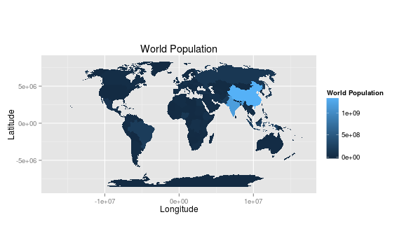
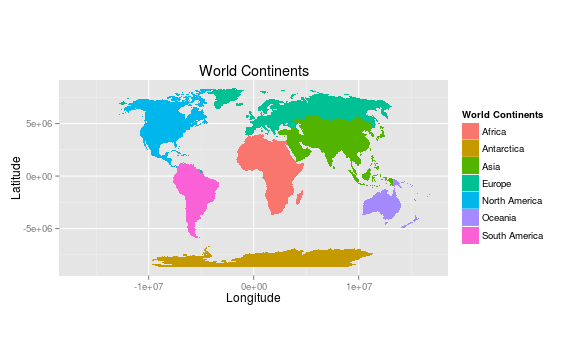
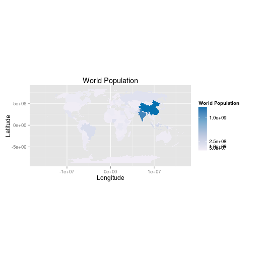
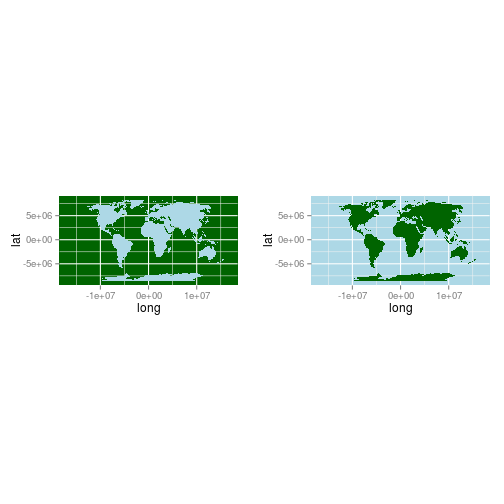
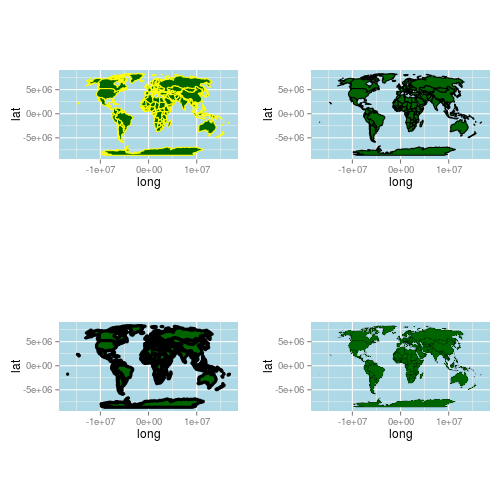
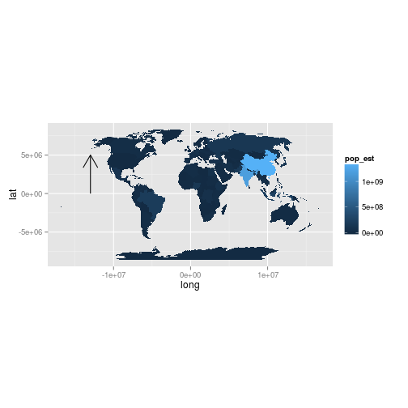
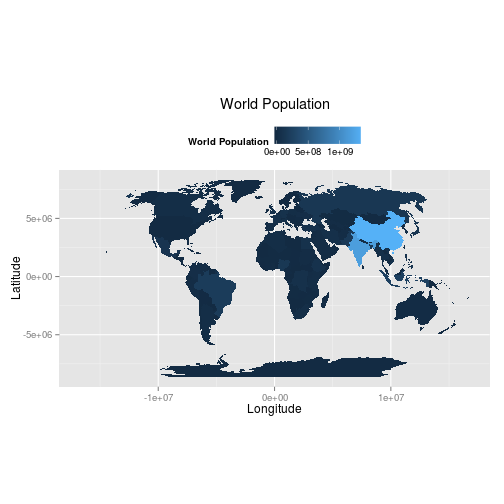
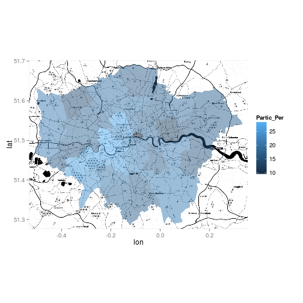

Fundamentals of Spatial Data Visualisation
==========================================

Good maps depend on sound analysis and can have an enormous impact on the 
understanding and communication of results. 
It has never been easier to produce a map. 
The underlying data required are available in unprecedented volumes 
and the technological capabilities of transforming them into compelling
maps and graphics are increasingly sophisticated and straightforward to use. 
Data and software, however, only offer the starting points of good spatial 
data visualisation since they need to be refined and calibrated by the researchers
seeking to communicate their findings.  In this section we will run through the
features of a good map. It is worth noting that not all good maps and 
graphics contain all the features below – they should simply be seen 
as suggestions rather than firm principles.

Effective map making is hard process – as Krygier and Wood (2011)
put it "there is a lot to see, think about, and do"" (p6). 
It often comes at the end of a period of intense data analysis
and perhaps when the priority is to get a paper finished or results
published and can therefore be rushed as a result. 
The beauty of R (and other scripting languages) is the ability to 
save code and simply re-run it with different data. 
Colours, map adornments and other parameters can therefore be quickly applied, 
so it is well worth creating a template script that adheres to best practice.

We have selected ggplot2 as our package of choice for the bulk of 
our maps and spatial data visualisations because it has a number 
of these elements at its core. The "gg"" in its slightly odd name stands for
"Grammar of Graphics"", which is a set of rules developed 
by Leland Wilkinson (2005) in a book of the same name. 
Grammar in the context of graphics works in much the same way as it does in language - 
it provides a structure. The structure is informed by both human perception 
and also mathematics to ensure that the resulting visualisations are 
both technically sound and comprehensible. By creating ggplot2, 
Hadley Wickham, implemented these rules as well as developing ways
in which plots can be built up in layers (see Wickham, 2010).
This layering component is especially useful in the context of
spatial data since it is conceptually the same as map layers in
Geographical Information Systems (GIS).

First load the libraries required for this section:

```r
library(rgdal)
library(ggplot2)
library(gridExtra)
```


Set your working directory as before:


```r
setwd("C:/Users/Uname/Desktop/sdvwR")
```


For this section we are going to use a map of the world to demonstrate 
some of the cartographic principles as they are introduced. 
The world map used is available from the Natural Earth website. 
Because these are already saved in the data folder, we can proceed to load the data. 


```r
wrld <- readOGR("data/", "ne_110m_admin_0_countries")
```

```
## OGR data source with driver: ESRI Shapefile 
## Source: "data/", layer: "ne_110m_admin_0_countries"
## with 177 features and 63 fields
## Feature type: wkbPolygon with 2 dimensions
```

```r
plot(wrld)
```

 


To see the first ten rows of attribute information assocuiated with each of the country boundaries type the following:


```r
head(wrld@data)[, 1:5]
```

```
##   scalerank      featurecla labelrank           sovereignt sov_a3
## 0         1 Admin-0 country         3          Afghanistan    AFG
## 1         1 Admin-0 country         3               Angola    AGO
## 2         1 Admin-0 country         6              Albania    ALB
## 3         1 Admin-0 country         4 United Arab Emirates    ARE
## 4         1 Admin-0 country         2            Argentina    ARG
## 5         1 Admin-0 country         6              Armenia    ARM
```


You can see there are a lot of columns associated with this file.
Although we will keep all of them, we are only really interested in
the population estimate ("pop_est") field. 
Before progressing it is is worth reprojecting the data in order that the
population data can be seen better. The coordinate reference system of 
the wrld shapefile is currently WGS84. This is the common latitude and 
longitude format that all spatial software packages understand. 
From a cartographic perspective the standard plots of this projection, 
of the kind produced above, are not suitable since they heavily distort
the shapes of those countries further from the equator. 
Instead the Robinson projection provides a good compromise
between areal distortion and shape preservation. We therefore project it as follows.


```r
wrld.rob <- spTransform(wrld, CRS("+proj=robin"))
plot(wrld.rob)
```

 


`+proj=robin` refers to the Robinson prjection. You will have spotted
from the plot that the countries in the world map are much better proportioned.

We now need to `fortify` this spatial data to convert it into a format
that ggplot2 understands, we also use `merge` to re-attach the
attribute data that is lost in the fortify operation.


```r
wrld.rob.f <- fortify(wrld.rob, region = "sov_a3")
```

```
## Loading required package: rgeos
## rgeos version: 0.3-2, (SVN revision 413M)
##  GEOS runtime version: 3.3.8-CAPI-1.7.8 
##  Polygon checking: TRUE
```

```r

wrld.pop.f <- merge(wrld.rob.f, wrld.rob@data, by.x = "id", by.y = "sov_a3")
```


The code below produces a map coloured by the population variable.
It demonstrates the sophistication of ggplot2 by first stringing 
together a series of plot commands and assigning them to a single R 
object called `map`. If you type `map` into the command line, 
R will then execute the code and generate the plot. By simple 
specifing our `fill` variable within the `aes()` part of the 
code and then using the `geom_polygon()` command ggplot2 will 
fill colour the countries using a default colour pallette and 
auto-generated key. As will be shown in the next section these
defaults can be easily altered to produce different looking maps.


```r
map <- ggplot(wrld.pop.f, aes(long, lat, group = group, fill = pop_est)) + geom_polygon() + 
    coord_equal() + labs(x = "Longitude", y = "Latitude", fill = "World Population") + 
    ggtitle("World Population")

map
```

 


## Colour and other aesthetics

Colour has an enormous impact on how people will percieve a graphic. 
Readers of a map come to it with a range of pre-conceptions about how the world looks. 

### Choropleth Maps

ggplot2 knows the different between continuous and categorical (nominal) data and will automatically assign the appropriate colour palettes when producing choropleth maps such as the one above. The default colour palettes are generally a good place to start but users may wish to vary them for a whole host of reasons, such as the need to print in black and white. The `scale_fill_` family of commands facilitate such customisation. For categorical data `scale_fill_manual()` is a useful command:


```r
# Produce a map of continents
map.cont <- ggplot(wrld.pop.f, aes(long, lat, group = group, fill = continent)) + 
    geom_polygon() + coord_equal() + labs(x = "Longitude", y = "Latitude", fill = "World Population") + 
    ggtitle("World Continents")

# To see the default colours
map.cont
```

 


To change the colour scheme:


```r
map.cont + scale_fill_manual(values = c("yellow", "red", "purple", "white", 
    "orange", "blue", "green", "black"))
```


Whilst `scale_fill_continuous()` works with continuous datasets:


```r
# note the use of the 'map' object created earler

map + scale_fill_continuous(low = "white", high = "black")

```


It is well worth looking at the *Color Brewer* palettes developed by Cynthia Brewer. These are designed to be colour blind safe and perceptually uniform such that no one colour jumps out more than any others. This latter characteristic is important when trying to produce impartial maps. R has a package that contains the colour palettes and these can be easily utlised by ggplot2.


```r
library(RColorBrewer)
# look at the help documents to see the palettes available. See
# http://colorbrewer2.org/
`?`(RColorBrewer)
# note the use of the scale_fill_gradientn() function rather than
# scale_fill_continuous() used above
map + scale_fill_gradientn(colours = brewer.pal(7, "YlGn"))
```


In addition to altering the colour scale used to represent continuous data it may also be desirable to adjust the breaks at which the colour transitions occur. There are many ways to select both the optimum number of breaks (i.e colour transtions) and the locations in the dataset at which they occur. The `classINT` package contains many ways to automatically create these breaks. We use the `grid.arrange` function from the gridExtra package to display the maps side by side.


```r
library(classInt)

# Specify how many breaks you want - generally this should be fewer than 7.

nbrks <- 6

# Here quantiles are used to identify the breaks (note that we are using the
# original 'wrld.rob' object and not the 'wrld.rob@data$pop_est.f'). USe the
# help files to see the full range of options.
brks <- classIntervals(wrld.rob@data$pop_est, n = nbrks, style = "quantile")

print(brks)
```

```
## style: quantile
##        [-99,1790208)    [1790208,4579439)    [4579439,9035536) 
##                   30                   29                   29 
##   [9035536,16639804)  [16639804,40784057) [40784057,1.339e+09] 
##                   30                   29                   30
```

```r

# Now the breaks can be easily inserted into the code above for a range of
# colour palettes
YlGn <- map + scale_fill_gradientn(colours = brewer.pal(nbrks, "YlGn"), breaks = c(brks$brks))

PuBu <- map + scale_fill_gradientn(colours = brewer.pal(nbrks, "PuBu"), breaks = c(brks$brks))

grid.arrange(YlGn, PuBu, ncol = 2)
```


If you are not happy with the automatic methods of specifying breaks it can also be done manually:


```r
library()
nbrks <- 4
brks <- c(1e+08, 2.5e+08, 5e+07, 1e+09)
map + scale_fill_gradientn(colours = brewer.pal(nbrks, "PuBu"), breaks = c(brks))
```

 


There are many other ways to specify and alter the colours in ggplot2 and these are outlined in the help documentation. There are also many examples online.

If the map's purpose is to clearly communicate data then it is often advisable to conform to conventions so as not to disorientate readers to ensure they can focus on the key messages contained in the data. A good example of this is the use of blue for bodies of water and green for landmasses. The code example below generates two plots with our wrld.pop.f object. The first colours the land blue and the sea (in this case the background to the map) green and the second is more conventional.


```r
map2 <- ggplot(wrld.pop.f, aes(long, lat, group = group)) + coord_equal()

blue <- map2 + geom_polygon(fill = "light blue") + theme(panel.background = element_rect(fill = "dark green"))

green <- map2 + geom_polygon(fill = "dark green") + theme(panel.background = element_rect(fill = "light blue"))

grid.arrange(blue, green, ncol = 2)
```

 


### Experimenting with line colour and line widths

In addition to conforming to colour conventions, line colour and width offer important parameters, which are often overlooked tools for increasing the legibility of a graphic. As the code below demonstrates, it is possible to adjust line colour through using the `colour` parameter and the line width using the `lwd` parameter. The impact of different line widths will vary depending on your screen size and resolution. If you save the plot to pdf (or an image) then the size at which you do this will also affect the line widths.


```r
map3 <- map2 + theme(panel.background = element_rect(fill = "light blue"))

yellow <- map3 + geom_polygon(fill = "dark green", colour = "yellow")

black <- map3 + geom_polygon(fill = "dark green", colour = "black")

thin <- map3 + geom_polygon(fill = "dark green", colour = "black", lwd = 0.1)

thick <- map3 + geom_polygon(fill = "dark green", colour = "black", lwd = 1.5)

grid.arrange(yellow, black, thick, thin, ncol = 2)
```

 


There are other parameters such as layer transparency (use the `alpha` parameter for this) that can be applied to all aspects of the plot - both points, lines and polygons. Space does not permit their full exploration here but more information is available from the many online examples and the ggplot2 package documentation.

## Map Adornments and Annotations


Map adornments and annotations are essential to orientate the viewer and provide context; they include graticules, north arrows, scale bars and data attribution. Not all are required on a single map, indeed it is often best that they are used sparingly to avoid unecessary clutter (Monkhouse and Wilkinson, 1971). With ggplot2 many of these are added automatically but they can be customised.


### North arrow

In the maps created so far, we have defined the *aesthetics* of the map
in the foundation function ggplot. The result of this is that all
subsequent layers are expected to have the same variables and
essentially contain data with the same dimensions as original dataset.
But what if we want to add a new layer from a completely different
dataset, e.g. to add an arrow? To do this, we must not add any arguments
to the `ggplot` function, only adding data sources one layer at a time:

Here we create an empty plot, meaning that each new layer must be given
its own dataset. While more code is needed in this example, it enables
much greater flexibility with regards to what can be included in new
layer contents. Another possibility is to use `geom_segment()` to add
a rudimentary arrow (see `?geom_segment` for refinements):


```r
library(grid)  # needed for arrow
ggplot() + geom_polygon(data = wrld.pop.f, aes(long, lat, group = group, fill = pop_est)) + 
    geom_line(aes(x = c(-1.3e+07, -1.3e+07), y = c(0, 5e+06)), arrow = arrow()) + 
    coord_fixed()  # correct aspect ratio
```

 


### Scale bar
ggplot2's scale bar capabilities are perhaps the least satisfactory element of the package. For this example we use the `geom_line()` function to draw a line of approximately 1km in length using the `lnd.f` object containing the London Boroughs discussed in Section 2. The reason for this is that it is in a projected coordinate system - British National Grid - so each map unit is worth 1m. In the case of the world map the distances at the equator in terms of degrees east to west are very different from those further north or south. Any line drawn using the the simple approach below would therefore be inaccurate. For maps covering large areas - such as the entire world - leaving the axis labels on will enable them to act as a graticule which will indicate distance. 


```r
load("data/lnd.f.RData")
ggplot() + geom_polygon(data = lnd.f, aes(long, lat, group = group)) + geom_line(aes(x = c(505000, 
    515000), y = c(158000, 158000)), lwd = 2) + annotate("text", label = "10km", 
    x = 510000, y = 160000) + coord_fixed()
```

 


### Legends

Legends are added automatically but can be customised in a number of ways. A few examples are included below with more details avaialble in the `ggplot2` documentation. 


```r
# Position
map + theme(legend.position = "top")
```

 


As you can see, this added the legend in a new place. Many more options for customization 
are available, as highlighed in the examples below.


```r
# Title
map + theme(legend.title = element_text(colour = "Red", size = 16, face = "bold"))

# Label Font Size and Colour
map + theme(legend.text = element_text(colour = "blue", size = 16, face = "italic"))

# Border and background box
map + theme(legend.background = element_rect(fill = "gray90", size = 0.5, linetype = "dotted"))
```


Adding Basemaps To Your Plots
----------

The development of the ggmap package has enabled the simple use of online mapping services such as Google Maps and OpenStreetMap for base maps. Using image tiles from these services spatial data can be placed in context as users can easily orientate themselves to streets and landmarks.

For this example we are going to use the shapefile of London sports participation introduced in Section 2. The data were originally projected to British National Grid (BNG) which is not compatible with the online map services used in the following examples. It therefore needs reprojecting - a step we completed earlier. The reprojected file can be loaded as follows:


```r
load("data/lnd.wgs84.RData")
```


The first job is to calculate the bounding box (bb for short) of the 
`lnd.wgs84` object to identify the geographic extent of the map. This information is used to request the appropriate map tiles from the map service of our choice. This process is conceptually the same as the size of your web browser or smartphone screen when using Google maps for navigation. The first line of code in the snippet below retrieves the bounding box and the two that follow add 5% so there is a little space around the edges of the data to be plotted.


```r
b <- bbox(lnd.wgs84)
b[1, ] <- (b[1, ] - mean(b[1, ])) * 1.05 + mean(b[1, ])
b[2, ] <- (b[2, ] - mean(b[2, ])) * 1.05 + mean(b[2, ])
# scale longitude and latitude (increase bb by 5% for plot) replace 1.05
# with 1.xx for an xx% increase in the plot size
```


This is then fed into the `get_map` function as the location parameter. The syntax below contains 2 functions. `ggmap` is required to produce the plot and provides the base map data.


```r
library(ggmap)

lnd.b1 <- ggmap(get_map(location = b))
```

```
## Warning: bounding box given to google - spatial extent only approximate.
```


`ggmap` follows the same syntax structures as ggplot2 and so can easily be integrated with the other examples included here. First `fortify` the `lnd.wgs84` object and then merge with the required attribute data.


```r
lnd.wgs84.f <- fortify(lnd.wgs84, region = "ons_label")
lnd.wgs84.f <- merge(lnd.wgs84.f, lnd.wgs84@data, by.x = "id", by.y = "ons_label")
```


We can now overlay this on our base map using the `geom_polygon()` function.


```r
lnd.b1 + geom_polygon(data = lnd.wgs84.f, aes(x = long, y = lat, group = group, 
    fill = Partic_Per), alpha = 0.5)
```


The resulting map looks reasonable, but it would be improved with a simpler base map in black and white. 
A design firm called *stamen* provide the tiles we need and they can be brought into the 
plot with the `get_map` function:


```r
lnd.b2 <- ggmap(get_map(location = b, source = "stamen", maptype = "toner", 
    crop = T))  #note the addition of the maptype parameter.
```


We can then produce the plot as before.


```r
lnd.b2 + geom_polygon(data = lnd.wgs84.f, aes(x = long, y = lat, group = group, 
    fill = Partic_Per), alpha = 0.5)
```


Finally, if we want to increase the detail of the base map, `get_map` has a zoom parameter.


```r
lnd.b3 <- ggmap(get_map(location = b, source = "stamen", maptype = "toner", 
    crop = T, zoom = 11))

lnd.b3 + geom_polygon(data = lnd.wgs84.f, aes(x = long, y = lat, group = group, 
    fill = Partic_Per), alpha = 0.5)
```

 

Spatial polygons are not the only data types compatible with `ggmap` - you can use any plot type and set of parameters available in `ggplot2`, making it an ideal companion package for spatial data visualisation. 

Summary
-----------------

There are an almost infinite number of different combinations colours, adornments and line widths that could be applied to a map, so take inspiration from maps and graphics you have seen and liked. The process is an iterative one, it will take multiple attempts to get right. Show your map to friends and colleagues - all will have an opinion but don’t be afraid to stand by the decisions you have taken. To give your maps a final polish you may wish to export them as a pdf using the `ggsave()` function and importing them into a vector graphics package such as Adobe Illustrator or Inkscape. 

The beauty of producing maps in a programming environment as opposed to the GUI offered by the majority of GIS software packages lies in the fact that each line of code can be easily adapted to a different dataset. Users can therefore create a series of scripts that act as templates and simply call them when required. This saves a huge amount of time and has the added advantage that all outputs will have a consistent style and thus offer more professional looking publications. 

