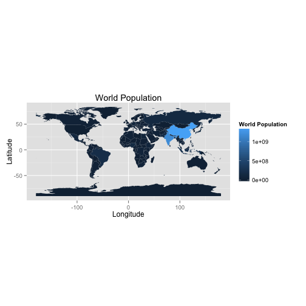
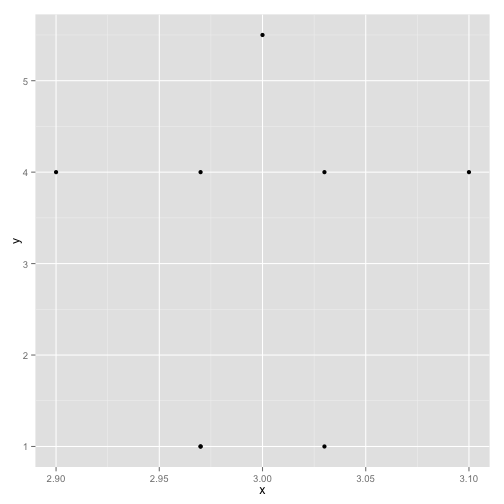
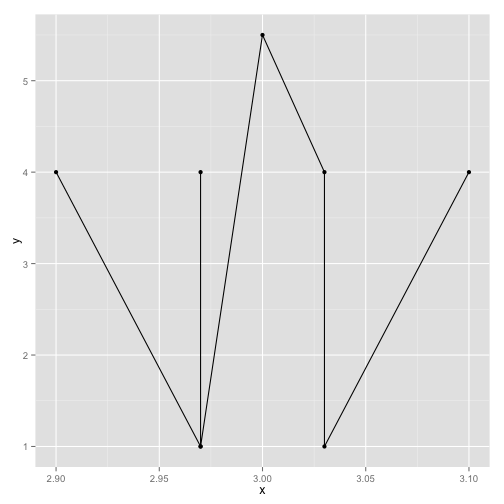
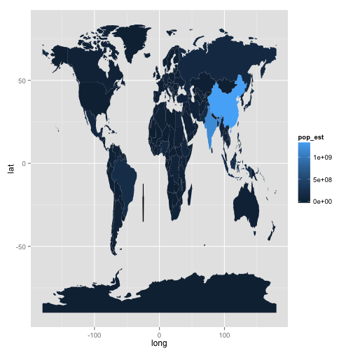

```r
# Packages we'll be using for this session
library(rgdal)
library(ggplot2)
library(grid)
# setwd('/Users/james/Dropbox/Abstracts_Papers_Reviews/Geocomp_Chapter')
```


# get data- map of the world

To download data of the world the block of code below was used. 
It is commented out because the data may already be on your system.
Uncomment each new line (by deleting the `#` symbol) if you need to 
download and extract the data.


```r
# download.file(url='http://www.naturalearthdata.com/http//www.naturalearthdata.com/download/110m/cultural/ne_110m_admin_0_countries.zip',
# 'ne_110m_admin_0_countries.zip', 'auto')
# unzip('ne_110m_admin_0_countries.zip', exdir = 'data/')
# file.remove('ne_110m_admin_0_countries.zip')
```


# read shape file using rgdal library


```r
wrld <- readOGR("data/", "ne_110m_admin_0_countries")
```

```
## OGR data source with driver: ESRI Shapefile 
## Source: "data/", layer: "ne_110m_admin_0_countries"
## with 177 features and 63 fields
## Feature type: wkbPolygon with 2 dimensions
```


# transform this to the robinson projection- this is much better for showing  population datasets


```r
wrld.rob <- spTransform(wrld, CRS("+init=ESRI:54030"))

wrld.rob.f <- fortify(wrld, region = "sov_a3")
```

```
## Loading required package: rgeos
## rgeos version: 0.2-16, (SVN revision 389)
##  GEOS runtime version: 3.3.3-CAPI-1.7.4 
##  Polygon checking: TRUE
```

```r

wrld.pop.f <- merge(wrld.rob.f, wrld@data, by.x = "id", by.y = "sov_a3")
```


# continuous colour ramp


```r
ggplot(wrld.pop.f, aes(long, lat, group = group, fill = pop_est)) + geom_polygon() + 
    coord_equal() + labs(x = "Longitude", y = "Latitude", fill = "World Population") + 
    ggtitle("World Population")
```

 


#better colours with more breaks- to finish

map+ scale_fill_continuous(breaks=)

#categorical variables

 
# Conforming to colour conventions

map2<- ggplot(wrld.pop.f, aes(long, lat, group = group)) + coord_equal()
  
blue<-map2+ geom_polygon(fill="light blue") + theme(panel.background = element_rect(fill = "dark green"))
  
green<-map2 + geom_polygon(fill="dark green") + theme(panel.background = element_rect(fill = "light blue"))
  
grid.arrange(green, blue, ncol=2)

#Experimenting with line colour and line widths

map3<-map2+theme(panel.background = element_rect(fill = "light blue"))

yellow<-map3+ geom_polygon(fill="dark green", colour="yellow") 
  
black<-map3+geom_polygon(fill="dark green", colour="black") 
  
thin<-map3+ geom_polygon(fill="dark green", colour="black", lwd=0.1) 

thick<-map3+ geom_polygon(fill="dark green", colour="black", lwd=1.5)
  
grid.arrange(yellow, black,thick, thin, ncol=2)

#Annotations

# North arrow

In the maps created so far, we have defined the *aesthetics* of the map 
in the foundation function `ggplot`. The result of this is that all subsequent
layers are expected to have the same variables and essentially contain 
data with the same dimensions as original dataset. But what if we want to 
add a new layer from a completely different dataset, e.g. to add an 
arrow? To do this, we must not add any arguments to the `ggplot` function, 
only adding data sources one layer at a time:


```r
arrow <- data.frame(c(2.97, 2.97, 2.9, 3, 3.1, 3.03, 3.03, 2.97), c(1, 4, 4, 
    5.5, 4, 4, 1, 1))
names(arrow) <- c("x", "y")
qplot(data = arrow, x = x, y = y)
```

 

```r
qplot(data = arrow, x = x, y = y) + geom_line()
```

 

```r
arrow <- arrow * 5 - 40

ggplot() + geom_polygon(data = wrld.pop.f, aes(long, lat, group = group, fill = pop_est)) + 
    geom_line(data = arrow, aes(x, y))
```

 


Here we created an empty plot, meaning that each new layer must be given its 
own dataset. While more code is needed in this example, it enables much 
greater flexibility with regards to what can be included in new layer contents. 
Another possibility is to use the `segment` geom to add a pre-made arrow:


```r
ggplot() + geom_polygon(data = wrld.pop.f, aes(long, lat, group = group, fill = pop_est)) + 
    geom_line(aes(x = c(-160, -160), y = c(0, 25)), arrow = arrow())
```

 


#scale bar- found this function

hscale_segment = function(breaks, ...)
{
    y = unique(breaks$y)
    stopifnot(length(y) == 1)
    dx = max(breaks$x) - min(breaks$x)
    dy = 1/30 * dx
    hscale = data.frame(ix=min(breaks$x), iy=y, jx=max(breaks$x),
jy=y)
    vticks = data.frame(ix=breaks$x, iy=(y - dy), jx=breaks$x, jy=(y +
dy))
    df = rbind(hscale, vticks)
    return(geom_segment(data=df,
                        aes(x=ix, xend=jx, y=iy, yend=jy),
                        ...))

}

hscale_text = function(breaks, ...)
{
    dx = max(breaks$x) - min(breaks$x)
    dy = 2/30 * dx
    breaks$y = breaks$y + dy
    return(geom_text(data=breaks,
                     aes(x=x, y=y, label=label),
                     hjust=0.5,
                     vjust=0,
                     ...))

}
